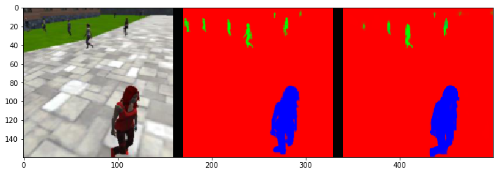
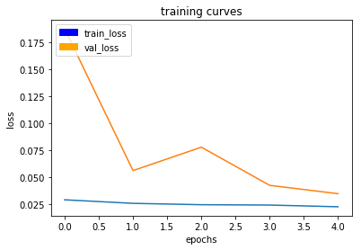

 # Setup
I have spent a lot of time ( or should I say wasted ) to setup environment for this project. Every single step from setting up 
the simulator to running the AWS instance with tensorflow-gpu had issues to me that I had hard time to overcome. I wasted days on those 
things and eventually  gave up on settng up the GPU based deep learning and  stick to CPU even though it was too time 
consuming to train the models this way. The most no-fun project in this course unfortunately. 

# Project
 ## Model
 
 ```python
 def fcn_model(inputs, num_classes):
    
    # add some number of Encoder blocks
    layer1 = encoder_block(inputs, 16, strides=2)
    layer2 = encoder_block(layer1, 32, strides=2)
    layer3 = encoder_block(layer2, 64, strides=2)    
    layer4 = encoder_block(layer3, 128, strides=2)    
    # Add 1x1 Convolution layer using conv2d_batchnorm().
    conv2d_batchnormed = conv2d_batchnorm(layer4, 128, kernel_size=1, strides=1)
    # Add the same number of Decoder Blocks as the number of Encoder Blocks
    decoder1 = decoder_block(conv2d_batchnormed, layer3, 128)
    decoder2 = decoder_block(decoder1, layer2, 64)
    decoder3 = decoder_block(decoder2, layer1, 32)
    x = decoder_block(decoder3, inputs, 16)
    
    return layers.Conv2D(num_classes, 3, activation='softmax', padding='same')(x)
 ```
 
 The above model is reducing the size (width, height) in the encoder part 2 times on every layer from (160, 160 ) to (10, 10), while incresing the depth 2 times as well from 16 to 128. This hopefully will help the model to recognize big features like the entire humans and the small features as well.  Decoder block is mirroring the encoder with the opposite effect -> doubling the dimentions using bilinear filter eventually calling for layers.Conv2D with 3 filters restoring the original 160x160x3 inputs.
 
##  Training parameters
```
learning_rate = 0.02
batch_size = 40
num_epochs = 5
steps_per_epoch = 100
validation_steps = 25
workers = 2
```
Taking into account that the training data contains roughly 4200 images for training and 1180 images 
for validation I have chosen the batch sizes and steps_per_epoch parameters as above to have roughly equal number of images
on every step. the actual sizes and learning rate have been achived experimentally. I tried to keep the number of 
epochs to be not very big as I was training the model on the CPU.

## Result
```

final_score = 
# And the final grade score is 
final_score = final_IoU * weight
print(final_score)
0.405941788408449
```
The final score has reached the project requirements. However the model obviously has issues. The below result shows a not bad 
ability of tracking the object when it is present in the camera's view ( it is behind the target ).
```
number of validation samples intersection over the union evaulated on 542
average intersection over union for background is 0.9929958142657815
average intersection over union for other people is 0.28636055903141044
average intersection over union for the hero is 0.86331796725804
number true positives: 539, number false positives: 1, number false negatives: 0
```


However when the object is far away the model can detect it right in a slightly bigger than a half of the cases:
```
number of validation samples intersection over the union evaulated on 322
average intersection over union for background is 0.9952288187465277
average intersection over union for other people is 0.3538920353087489
average intersection over union for the hero is 0.24947350865882728
number true positives: 176, number false positives: 4, number false negatives: 125
```
it is worth trying to icrease the number of epics as it looks like that the evaluation loss just starts to converge to some small value around epic 5. 



Could be that the model's architecture does not very well suit this situation.


