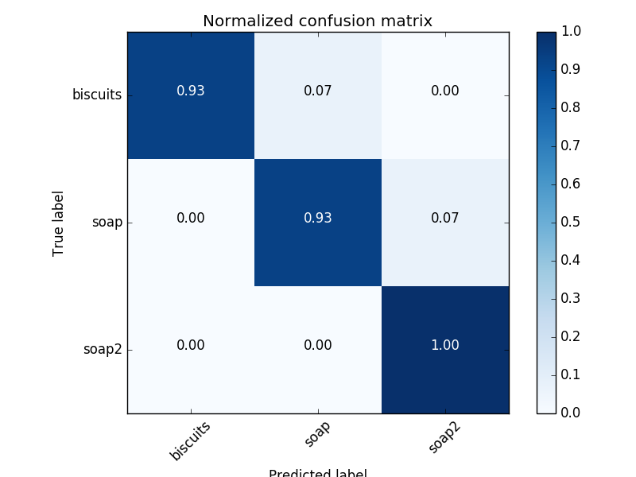
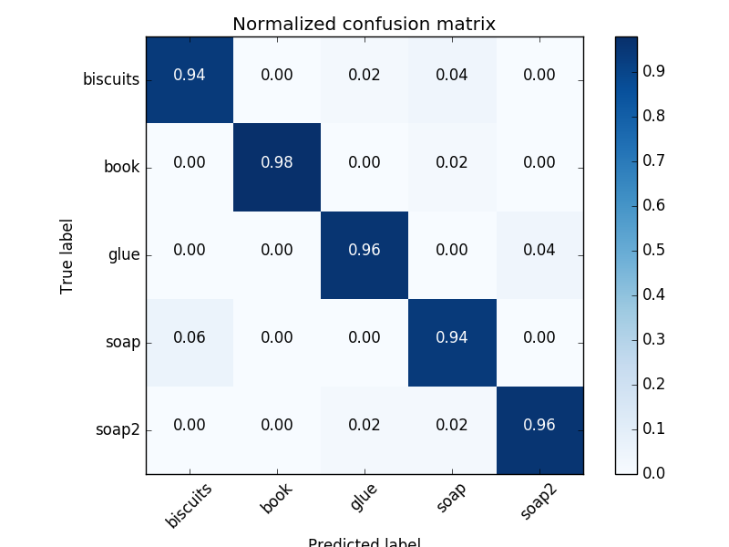
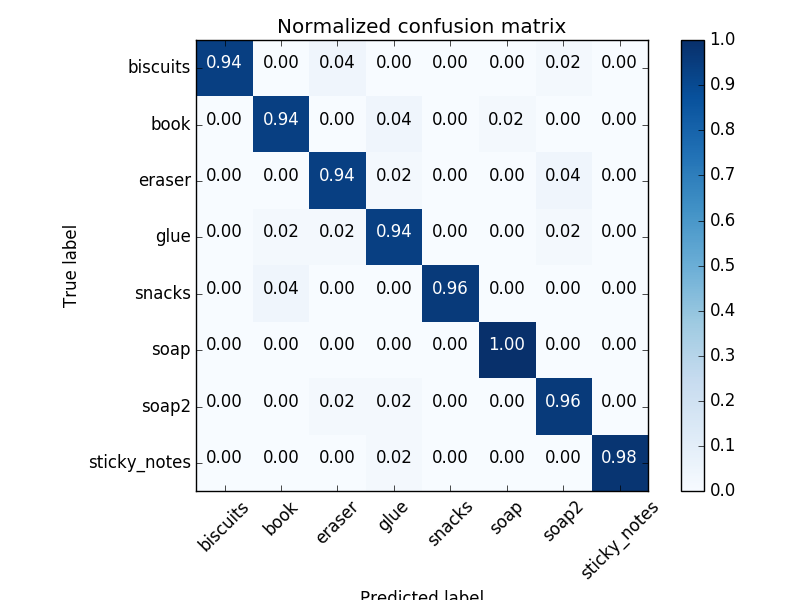
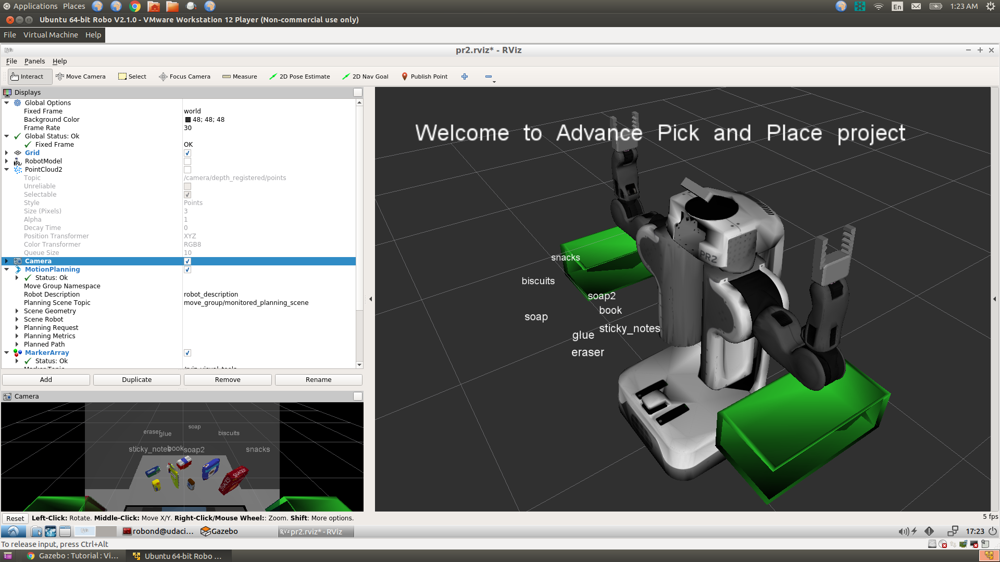

## Project: Perception Pick & Place
### Writeup Template: You can use this file as a template for your writeup if you want to submit it as a markdown file, but feel free to use some other method and submit a pdf if you prefer.

---

# Required Steps for a Passing Submission:
1. Extract features and train an SVM model on new objects (see `pick_list_*.yaml` in `/pr2_robot/config/` for the list of models you'll be trying to identify). 
2. Write a ROS node and subscribe to `/pr2/world/points` topic. This topic contains noisy point cloud data that you must work with.
3. Use filtering and RANSAC plane fitting to isolate the objects of interest from the rest of the scene.
4. Apply Euclidean clustering to create separate clusters for individual items.
5. Perform object recognition on these objects and assign them labels (markers in RViz).
6. Calculate the centroid (average in x, y and z) of the set of points belonging to that each object.
7. Create ROS messages containing the details of each object (name, pick_pose, etc.) and write these messages out to `.yaml` files, one for each of the 3 scenarios (`test1-3.world` in `/pr2_robot/worlds/`).  [See the example `output.yaml` for details on what the output should look like.](https://github.com/udacity/RoboND-Perception-Project/blob/master/pr2_robot/config/output.yaml)  
8. Submit a link to your GitHub repo for the project or the Python code for your perception pipeline and your output `.yaml` files (3 `.yaml` files, one for each test world).  You must have correctly identified 100% of objects from `pick_list_1.yaml` for `test1.world`, 80% of items from `pick_list_2.yaml` for `test2.world` and 75% of items from `pick_list_3.yaml` in `test3.world`.
9. Congratulations!  Your Done!

# Extra Challenges: Complete the Pick & Place
7. To create a collision map, publish a point cloud to the `/pr2/3d_map/points` topic and make sure you change the `point_cloud_topic` to `/pr2/3d_map/points` in `sensors.yaml` in the `/pr2_robot/config/` directory. This topic is read by Moveit!, which uses this point cloud input to generate a collision map, allowing the robot to plan its trajectory.  Keep in mind that later when you go to pick up an object, you must first remove it from this point cloud so it is removed from the collision map!
8. Rotate the robot to generate collision map of table sides. This can be accomplished by publishing joint angle value(in radians) to `/pr2/world_joint_controller/command`
9. Rotate the robot back to its original state.
10. Create a ROS Client for the “pick_place_routine” rosservice.  In the required steps above, you already created the messages you need to use this service. Checkout the [PickPlace.srv](https://github.com/udacity/RoboND-Perception-Project/tree/master/pr2_robot/srv) file to find out what arguments you must pass to this service.
11. If everything was done correctly, when you pass the appropriate messages to the `pick_place_routine` service, the selected arm will perform pick and place operation and display trajectory in the RViz window
12. Place all the objects from your pick list in their respective dropoff box and you have completed the challenge!
13. Looking for a bigger challenge?  Load up the `challenge.world` scenario and see if you can get your perception pipeline working there!

## [Rubric](https://review.udacity.com/#!/rubrics/1067/view) Points
### Here I will consider the rubric points individually and describe how I addressed each point in my implementation.  

---
### Writeup / README

#### 1. Provide a Writeup / README that includes all the rubric points and how you addressed each one.  You can submit your writeup as markdown or pdf.  

You're reading it!

### Preparing the models for the tests 1-3 in the project

To prepare the models I tried to follow the steps used in the example 3. I tried to experiment with the different number of training samples and colo/normal histogram threashold. In fact I tried to cheat a bit and let the numpy histogram to select the number of bins automativally proportinal to n1/3 by selecting bins='auto' ( see here for more details https://docs.scipy.org/doc/numpy-1.14.0/reference/generated/numpy.histogram.html). However that doesn't seem to work very well as the training script crashes throwing the error that it cannot assign a sequence as an  array element. Seems like in the 'auto' mode the features array generated becomes sparse ( too many features generated and some of them are even zeroes ) and sklearn does not survive that.  In anyways eventually I have chosen the following parametrs that are seemed to be good enough for all the 3 tests in the project:
1. color hist bins *64*
2. normal hist bins left at a default *10*
3. training samples *50*
4. Use convertion to HSV

Selection of the parameters as above has gived me these confusion matrices:

### Pick and Place Setup

I have dumped yaml output files  for all the 3 test cases. To run each test case I need to manually change the index in the project_template.py for the pre-trained model being used and scene_num variable in pr2_mover function.

These are the useful points to understand parameters selection for the filter in  project_template.py:

1. While testing the project I figured that I detect  more objects that are actually rpesent on the table. That is because if I apply the pass-throuh filter only over 'z' axis as it is decribed in the lectures I do see remains of the dropboxes on the table which is considered as 2 additional objects by the predictor and some random label are getting assigned for those. In order to get rid of the dropboxes in the final could image I do apply pass-through filter first over 'z' and then over 'x' axis.
2. The input mdoel contains noise that needs to be get rid of. I am applying the noise filter to the final 'outliers' point cloud after RANSAC has been applied. By experimenting with dumping of the pcl images I have selected the the number of neighboring points to 10 and threashold scale factor to 0.2

