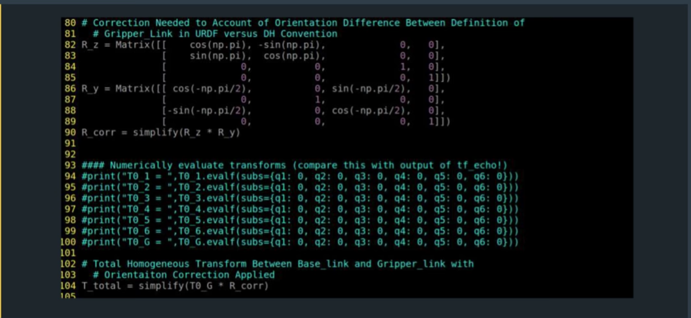

## Project: Kinematics Pick & Place
### Writeup Template: You can use this file as a template for your writeup if you want to submit it as a markdown file, but feel free to use some other method and submit a pdf if you prefer.

---
### Kinematic Analysis
#### 1. Run the forward_kinematics demo and evaluate the kr210.urdf.xacro file to perform kinematic analysis of Kuka KR210 robot and derive its DH parameters.


DH table is obtained basing on the below forward kinematics picture and kr210.urdf.xacro file:


  
where


The first raw of DH parameters: (  α<sub>0</sub>, a<sub>0</sub>, d<sub>1</sub> , θ<sub>1</sub>)
α<sub>0</sub>, a<sub>0</sub> are zeroes, θ<sub>1</sub> is a variable. In order to figure d<sub>1</sub> we draw a line from X<sub>0</sub> to X<sub>1</sub> along Z<sub>1</sub> as it is shown on the picture above. Since joint 1 is revolute d<sub>1</sub> is a fixed distance.  By looking at the urdf file we can observe that base joint origin is at <0,0,0> position and join1 is at <0,0,0.33> and joint2 is <0.35,0, 0.42> which leads to d<sub>1</sub> = 0.75 and thus the first raw is

```
(  0, 0, 0.75 , θ<sub>1</sub>)
```

α<sub>1</sub> is an angle between Z<sub>1</sub> and Z<sub>2</sub> measured over X<sub>1</sub> which is -pi/2.  a1 is a distance from Z1 to Z2 along X1, which is 0.35 (joint2 x= 0.35, join1 x = 0 ), d<sub>2</sub> is a signed distance from X<sub>1</sub> to X<sub>2</sub> along Z<sub>2</sub> which is apparently equal to 0 ( O<sub>1</sub> and O<sub>2</sub> define the line which  Z<sub>2</sub> is perpendicular to no matter how joints 1 and 2 rotate).   On the kinematic picture Kuka is drawn in zero configuration with a constant -90 degrees offset between X<sub>1</sub> and X<sub>2</sub>, thus θ<sub>2</sub> being a variable parameter is defined as θ<sub>2</sub> - pi/2, thus we get the raw 2

```
(  -p2/2, 0.35, 0 , θ<sub>2</sub> - pi/2)
```

Continue to build the DH parameters further we get the following table:


#### 2. Using the DH parameter table you derived earlier, create individual transformation matrices about each joint. In addition, also generate a generalized homogeneous transform between base_link and gripper_link using only end-effector(gripper) pose.





#### 3. Decouple Inverse Kinematics problem into Inverse Position Kinematics and inverse Orientation Kinematics; doing so derive the equations to calculate all individual joint angles.

θ<sub>1</sub> is an angle betwwen X<sub>0</sub> and X<sub>1</sub> measured over Z<sub>1</sub>. Note that when joint 1  X axis is rotated by construction  WC will be rigidly rotated with it. Below picture is illustrating θ<sub>1</sub> calculation approach:


**Note that joints enumeration on the picture above is wrong, it should be 0,1,2,3,4 as the XY axises obviously belomg to the base frame ( I missed one node there). But it doesn't change the idea behind it in anyways**.

θ<sub>2</sub> is an angle between X<sub>1</sub> and X<sub>2</sub> measured over Z<sub>2</sub>. On the picture below θ<sub>2</sub> is shown on the X<sub>2</sub>Y<sub>2</sub> plane, from where θ<sub>2</sub> = pi/2 - a - atan(x,y) ,where (x,y) are the coordinates of the point of WC projected on that plane. Now let's make a simple observation that frame2 origin has a fixed offset (a<sub>1</sub>, d<sub>1</sub>) from frame 0 in frame0's coordinate system.  From the previous picture where θ<sub>1</sub> was drawn we can figure that X<sub>1</sub> is projected on hepotenus of a triangle with the sides equal to (x<sub>c</sub>, y<sub>c</sub>) which makes it to be sqrt(xc^2 + yc^2), or expressed in terms of the base frame it is sqrt(x<sub>c</sub>^2 + y</sub>c</sub>^2) - a1, but on X<sub>0</sub>Y<sub>0</sub> plane X<sub>1</sub> is collinear with Y<sub>2</sub> as it follows from the  forward kinematics picture, thus y = sqrt(x<sub>c</sub>^2 + y<sub>c</sub>^2) - a<sub>1</sub> . Also, since the projection is done along Z axis, x coordinate in terms of the base frame  would be x = z<sub>c</sub> - d<sub>1</sub>.  


θ<sub>3</sub> is an angle between X<sub>2</sub> and X<sub>3</sub> measured over Z<sub>3</sub>. From the picture below we can conclude that θ<sub>3</sub> = (b - d), where d = atan2(d4,-a3). 


On the image above the angles *a* , *b* and *c* can be obtained using a cosine theorem, for that we need to figure first *A*, *B* and *C* values for the triangle. *C* is a distance from link 2 to link 3 which can be obtained from DH table, since Z<sub>2</sub>  and Z<sub>3</sub> are parallel, (a2 parameter which is a distance from Z<sub>2</sub>  to Z<sub>3</sub> measured over X<sub>2</sub>) as it is shown on the forward kinematics picture above.

In order to figure *A* we can look at the picture above. d4 and a3  there define the sides of a right triangle and from there we can figure *A*. d4 is the distance from X3 to X4 over Z4 and a3 is the distance from Z3 to Z4 over X3.

As follows from above *B* is a hepotenus of the another right triangle with the sides  y = sqrt(x<sub>c</sub>^2 + y<sub>c</sub>^2) - a<sub>1</sub> and x = z<sub>c</sub> - d<sub>1</sub>.

For finding θ<sub>4</sub>, θ<sub>5</sub> and θ<sub>6</sub>  let's see how R<sub>3,6</sub> matrix looks like

```
R3_6 = Matrix([ [-sin(theta4)*sin(theta6) + cos(theta4)*cos(theta5)*cos(theta6), -sin(theta4)*cos(theta6) - sin(theta6)*cos(theta4)*cos(theta5), -sin(theta5)*cos(theta4)], 
                [sin(theta5)*cos(theta6),                                        -sin(theta5)*sin(theta6),                                       cos(theta5),              ], 
                [-sin(theta4)*cos(theta5)*cos(theta6) - sin(theta6)*cos(theta4), sin(theta4)*sin(theta6)*cos(theta5) - cos(theta4)*cos(theta6), sin(theta4)*sin(theta5)] ])
```


From above we can observe that R<sub>2,2</sub>/-R<sub>0,2</sub> = tan(theta4) or equivalently theta4 = atan2(R<sub>2,2</sub>, -R<sub>0,2</sub>)
Similarly -R<sub>1,1</sub>/R<sub>1,0</sub> = tan(theta6) and equivalently theta6 = atan2(-R<sub>1,1</sub>, R<sub>1,0</sub>)
Now, when we known theta4 and theta6,  sin(theta4) is a known value (f.ex. C) we denote that R<sub>2,2</sub>/R<sub>1,2</sub> = C*tan(theta5), or theta5 = atan2(R<sub>2,2</sub>, C * R<sub>1,2</sub>).

### Project Implementation

#### 1. Fill in the `IK_server.py` file with properly commented python code for calculating Inverse Kinematics based on previously performed Kinematic Analysis. Your code must guide the robot to successfully complete 8/10 pick and place cycles. Briefly discuss the code you implemented and your results. 

 I do not use symbolic computations at all in my code, since they are not really needed. Also I do avoid the forward kinematics part as well as it is not needed either to solve this particular exersice.  I basically need  only R0_3 and
R3_6 as it is seen in the lectures ( see "Inverse Kinematics with Kuka KR210"), thus I use their symbolic expression (pre-computed ) and just substitute there the corresponding angles when needed. 

The handle_calculate_IK function is pretty small and straight-forward. I was basically following the  guide presented under "Inverse Kinematics with Kuka KR210" chapter.


